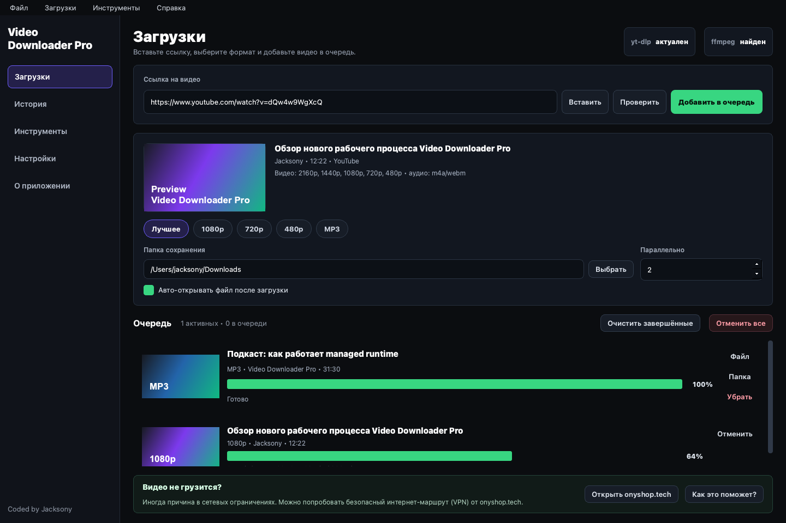
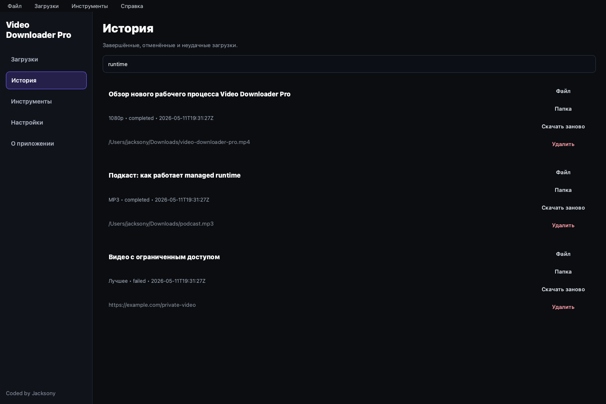
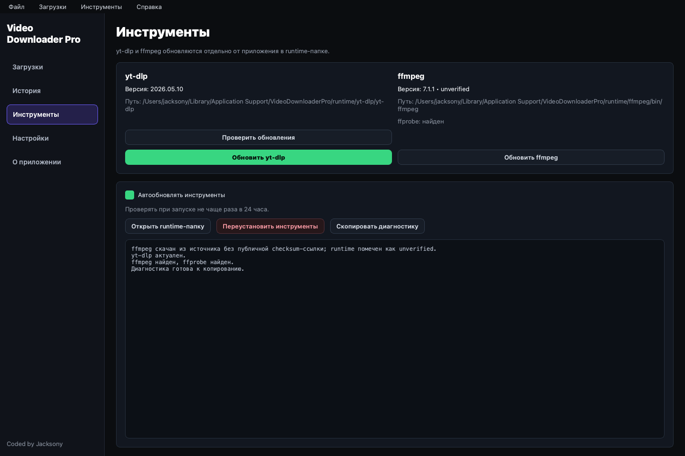

# Video Downloader Pro

Desktop-приложение на `Python` + `PySide6` для загрузки видео и аудио через внешний `yt-dlp`.

Приложение распространяется как один Windows exe для пользователя, но `yt-dlp`, `ffmpeg` и `ffprobe` живут отдельно в runtime-папке пользователя и могут обновляться без пересборки приложения.

## Скриншоты

### Загрузки



### История



### Инструменты



## Возможности

- Новый интерфейс на русском: Загрузки, История, Инструменты, Настройки, О приложении.
- Очередь загрузок с параллельностью от 1 до 5 задач.
- Форматы: Лучшее, 1080p, 720p, 480p, MP3.
- Проверка ссылки до скачивания через внешний `yt-dlp`.
- Загрузка через `QProcess`, без `import yt_dlp` в основном движке.
- Управляемый runtime toolchain в `%LOCALAPPDATA%\VideoDownloaderPro\runtime`.
- Автообновление `yt-dlp`; установка/обновление Windows `ffmpeg` из fallback или zip-источника.
- SQLite-история загрузок с поиском, повтором, открытием файла и папки.
- Логи и диагностика: app/toolchain/downloads.
- Ненавязчивый блок помощи при сетевых ограничениях с ссылкой на [onyshop.tech](https://onyshop.tech).
- Горячие клавиши сохранены.

## Runtime-инструменты

Windows runtime:

```text
%LOCALAPPDATA%\VideoDownloaderPro\
  runtime\
    yt-dlp\
      yt-dlp.exe
    ffmpeg\
      bin\
        ffmpeg.exe
        ffprobe.exe
    manifest.json
  logs\
  data\
    history.sqlite
    settings.json
  cache\
```

При первом запуске приложение:

1. Создаёт папки в AppData.
2. Копирует fallback-инструменты из PyInstaller bundle (`sys._MEIPASS\toolchain`) в runtime.
3. Если fallback отсутствует, пробует найти системные `yt-dlp`/`ffmpeg`.
4. Показывает статус на странице «Инструменты».

Обновление не пытается менять файлы внутри exe. Новые версии скачиваются в `runtime\.staging`, проверяются и только потом атомарно заменяют рабочие файлы. При ошибке старая рабочая версия остаётся на месте.

`yt-dlp` скачивается из GitHub Releases с попыткой проверки `SHA2-256SUMS`. Windows `ffmpeg` берётся из `gyan.dev` essentials zip; если публичной checksum-ссылки нет, runtime помечается как `unverified` в UI и manifest.

## Автообновление

Автообновление включено по умолчанию и проверяет инструменты при запуске не чаще одного раза в 24 часа.

Отключить можно в приложении:

- `Инструменты` → `Автообновлять инструменты`
- или `Настройки` → `Автообновление yt-dlp/ffmpeg`

Вручную:

- `Инструменты` → `Проверить обновления`
- `Инструменты` → `Обновить yt-dlp`
- `Инструменты` → `Обновить ffmpeg`
- `Инструменты` → `Переустановить инструменты`

## Быстрый старт из исходников

```bash
git clone https://github.com/Jacksony100/Youtube-Downloader.git
cd Youtube-Downloader
python3 -m venv .venv
source .venv/bin/activate   # Windows: .venv\Scripts\activate
pip install -r requirements.txt
python -m app.main
```

Compatibility wrapper оставлен:

```bash
python main.py
```

Для разработки и тестов:

```bash
pip install -r requirements-dev.txt
pytest
python -m compileall app core ui tests main.py
```

## Сборка Windows onefile

На Windows:

```powershell
.\scripts\build_release_windows.ps1
```

Результат:

- `dist\VideoDownloaderPro.exe`
- `dist\VideoDownloaderPro-win-x64.zip`

Скрипт:

1. Создаёт `.venv`, если нужно.
2. Устанавливает зависимости.
3. Скачивает fallback `yt-dlp.exe` и проверяет SHA256.
4. Скачивает fallback `ffmpeg.exe`/`ffprobe.exe`.
5. Собирает `--onefile --windowed` через PyInstaller.
6. Добавляет fallback tools внутрь exe как `toolchain\...`.
7. Проверяет наличие `dist\VideoDownloaderPro.exe`.

Опциональный Nuitka-режим сохранён:

```powershell
.\scripts\build_release_windows.ps1 -UseNuitka
```

Если fallback-инструменты уже подготовлены и скачивать их не нужно:

```powershell
.\scripts\build_release_windows.ps1 -SkipToolDownloads
```

## GitHub Actions

Workflow `.github/workflows/build-windows-x64.yml` запускает Windows-сборку и публикует zip-артефакт:

- `VideoDownloaderPro.exe`
- `README.md`
- `CHANGELOG.md`

## Горячие клавиши

- `Ctrl+L` фокус на поле ссылки
- `Ctrl+D` добавить в очередь
- `Ctrl+I` проверить ссылку
- `Ctrl+O` открыть папку загрузок
- `Ctrl+Shift+C` отменить все
- `Ctrl+Shift+X` очистить завершённые
- `Ctrl+Q` выход
- `F1` страница «О приложении»

## Структура проекта

```text
app/
  main.py                  # тонкая точка входа
core/
  paths.py                 # AppData/runtime/cache/log/data paths
  settings.py              # JSON settings + миграция старого конфига
  toolchain.py             # managed yt-dlp/ffmpeg runtime
  downloader.py            # QProcess metadata/download workers
  history.py               # SQLite history
  logger.py                # app/toolchain/download logs + diagnostics
  validators.py            # URL и человекочитаемые ошибки
ui/
  main_window.py
  sidebar.py
  pages/
  widgets/
  styles/dark.qss
scripts/
  build_release_windows.ps1
```

## Важно

- Поддержка сайтов зависит от актуальности `yt-dlp`.
- Приложение не обходит авторизацию, возрастные, региональные, платные или DRM-ограничения.
- Если загрузка ломается после изменений на платформе, сначала обновите `yt-dlp` через страницу «Инструменты».

## Донат

Поддержать проект (USDT TRC20):

- Адрес: `TAa2pm6veN9Jd7X93juoqvoT9WE7QxLKGq`
- Сеть: `TRON (TRC20)`

## Disclaimer

This software is provided "as is", without warranties of any kind.
You are responsible for compliance with local laws, copyright rules, and platform terms.
