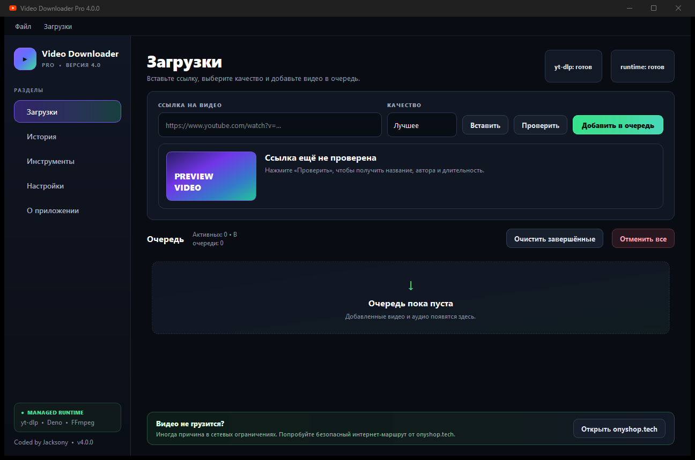
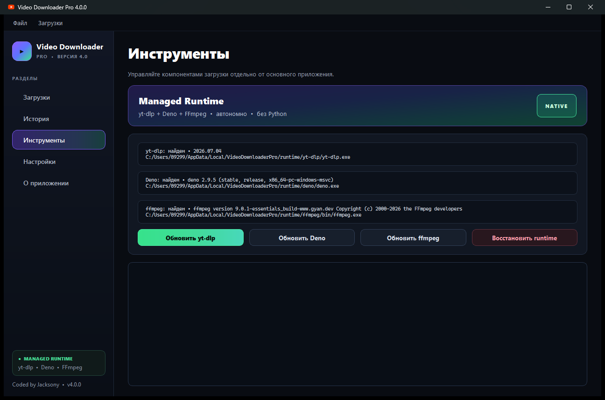

<div align="center">

# Video Downloader Pro

### Красивый и быстрый загрузчик видео и музыки для Windows и macOS

[](https://github.com/Jacksony100/Youtube-Downloader/releases/latest)
[](https://github.com/Jacksony100/Youtube-Downloader/actions/workflows/build-windows-x64.yml)
[](https://github.com/Jacksony100/Youtube-Downloader/actions/workflows/build-macos.yml)
[](https://isocpp.org/)
[](https://www.qt.io/)

Вставьте ссылку, выберите качество — всё остальное приложение сделает само.

[**Скачать последнюю версию**](https://github.com/Jacksony100/Youtube-Downloader/releases/latest)

</div>



## Почему Video Downloader Pro

| | Возможность | Что это даёт |
|---|---|---|
| 🎬 | **Видео и музыка** | Лучшее качество, 1080p, 720p, 480p и MP3 |
| ⚡ | **Очередь загрузок** | До пяти параллельных задач с прогрессом и скоростью |
| 🔎 | **Проверка ссылки** | Название, автор и длительность до начала загрузки |
| 🧰 | **Всё уже внутри** | `yt-dlp`, Deno и FFmpeg входят в Windows-релиз |
| 🧠 | **Современный YouTube runtime** | Deno явно подключается через `--js-runtimes` |
| 🗂️ | **История и настройки** | Поиск по загрузкам, выбор папки и автооткрытие файла |
| 🚀 | **Без Python** | Интерфейс и управление процессами написаны на C++20/Qt 6 |

## Установка на Windows

1. Откройте [последний релиз](https://github.com/Jacksony100/Youtube-Downloader/releases/latest).
2. Скачайте **`VideoDownloaderPro-Setup-4.0.1.exe`**.
3. Запустите установщик и следуйте подсказкам.

Установщик добавляет приложение в меню «Пуск», по желанию создаёт ярлык на рабочем столе и поддерживает штатное удаление через настройки Windows. Права администратора не требуются.

> Нужна переносная версия? Скачайте `VideoDownloaderPro-win-x64.zip`, распакуйте архив и запустите `VideoDownloaderPro.exe`.

## Интерфейс



<div align="center"><b>Обновление yt-dlp, Deno и FFmpeg прямо из приложения</b></div>

## Как это работает

```text
Ссылка
  └─► Проверка метаданных
        └─► Очередь задач
              ├─► yt-dlp + Deno
              ├─► FFmpeg
              └─► Готовый файл + запись в историю
```

Приложение хранит обновляемые инструменты отдельно от установленной программы:

```text
%LOCALAPPDATA%\VideoDownloaderPro\
├── runtime\
│   ├── yt-dlp\yt-dlp.exe
│   ├── deno\deno.exe
│   └── ffmpeg\bin\
├── data\
│   ├── settings.ini
│   └── history.json
└── logs\
```

Так `yt-dlp`, Deno и FFmpeg можно обновлять прямо из приложения без переустановки основной программы.

<details>
<summary><b>Сборка из исходников</b></summary>

### Требования

- CMake 3.21+
- Ninja
- компилятор с поддержкой C++20
- Qt 6.6+: `Core`, `Widgets`, `Network`, `Test`

### CMake

```powershell
cmake -S . -B build-cpp -G Ninja `
  -DCMAKE_BUILD_TYPE=Release `
  -DCMAKE_PREFIX_PATH="$env:Qt6_DIR" `
  -DBUILD_TESTING=ON
cmake --build build-cpp
ctest --test-dir build-cpp --output-on-failure
```

### Windows-пакет и установщик

```powershell
./scripts/build_release_windows.ps1 `
  -QtDir "$env:Qt6_DIR" `
  -InnoSetupCompiler "$env:ISCC_PATH"
```

Результаты:

- `dist/VideoDownloaderPro-win-x64.zip`
- `dist/VideoDownloaderPro-Setup-4.0.1.exe`

### macOS

```bash
Qt6_DIR=/path/to/Qt/lib/cmake/Qt6 ./scripts/build_release.sh
```

</details>

## Структура проекта

```text
src/                 C++/Qt приложение
tests_cpp/           Qt Test / CTest
ui/styles/           фирменная QSS-тема
installer/           Inno Setup
scripts/             release-сборки Windows и macOS
.github/workflows/   непрерывная сборка и проверка пакетов
```

## Важно

- Работа конкретной площадки зависит от актуальности `yt-dlp`.
- Приложение не обходит DRM, платный доступ, авторизацию и региональные ограничения.
- Пользователь самостоятельно отвечает за соблюдение авторских прав и правил платформ.

<div align="center">

Сделано с вниманием к деталям • **Video Downloader Pro 4**

</div>
